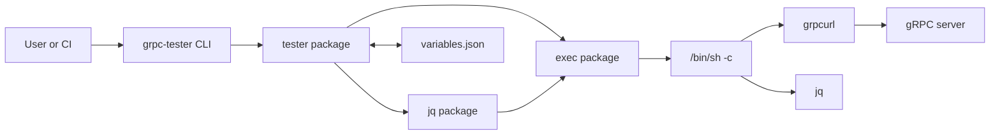
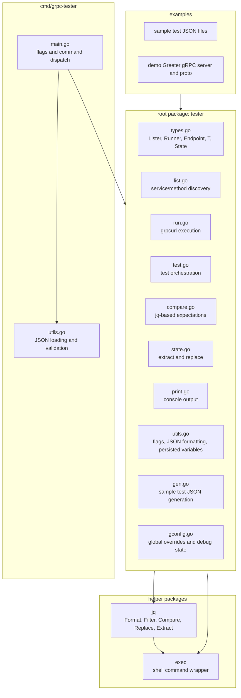
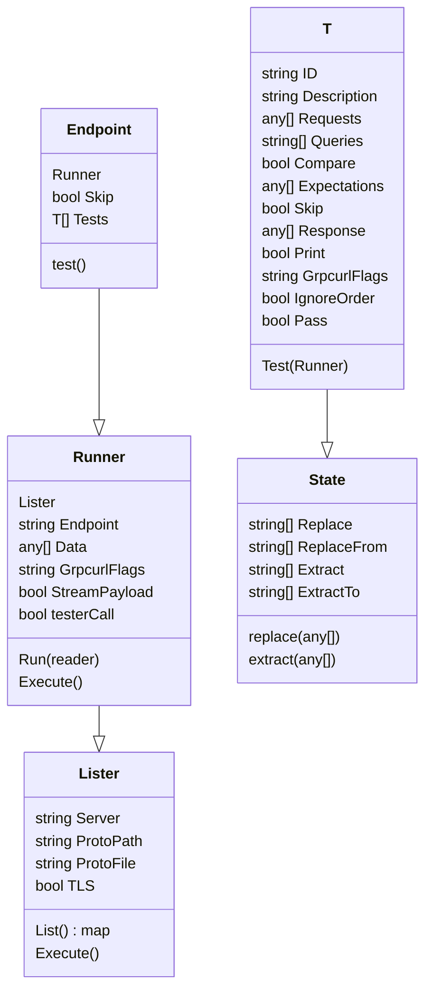
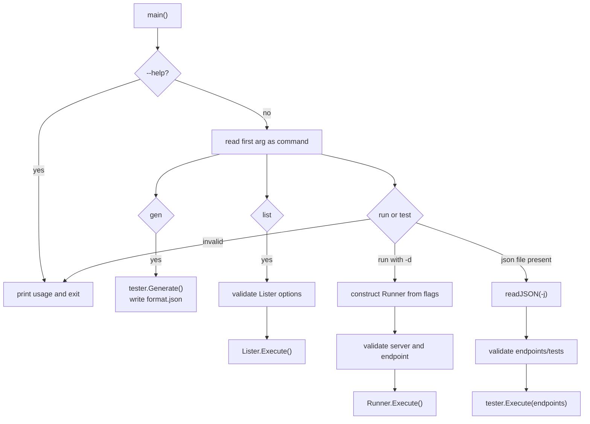
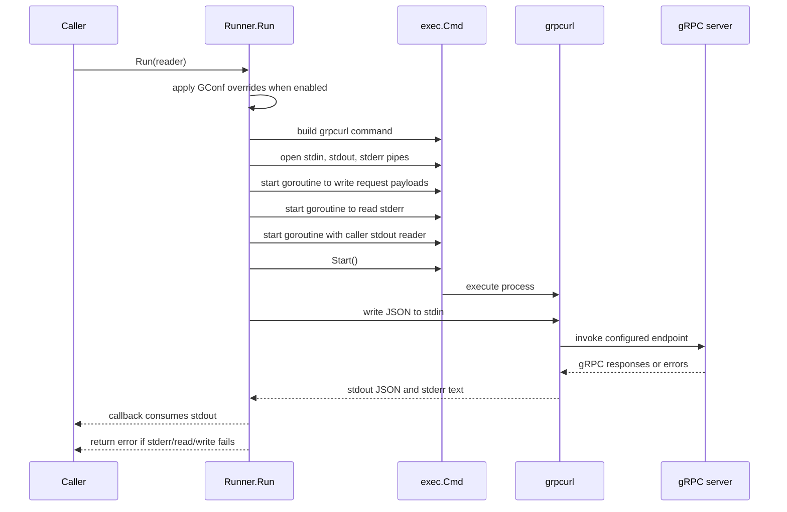
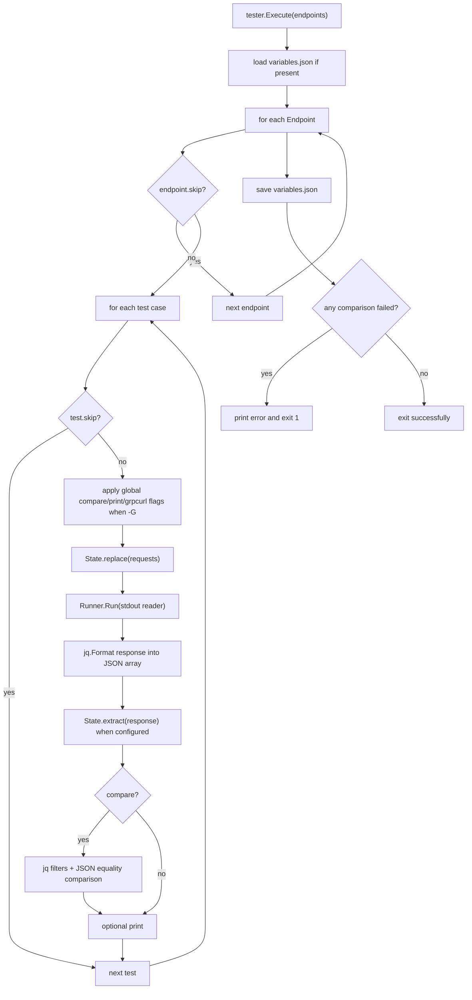
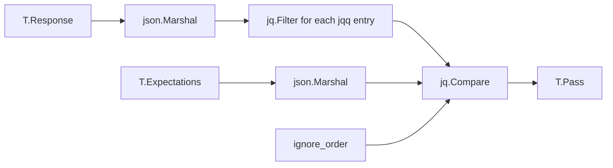
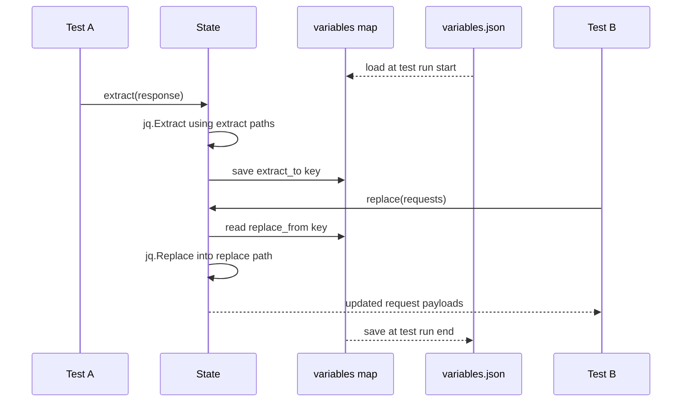
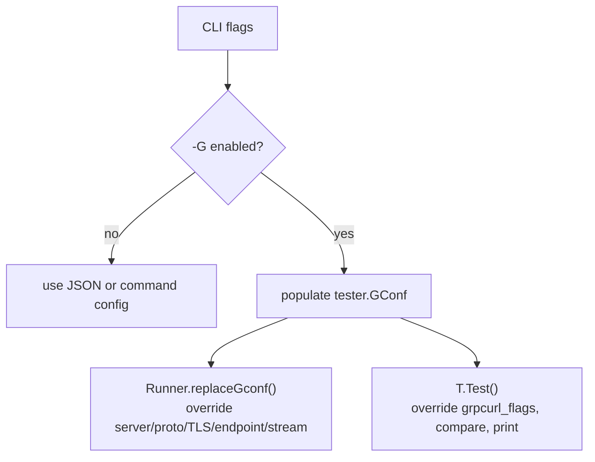
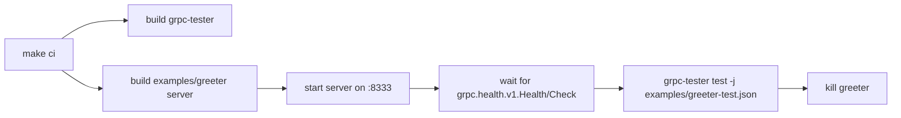

# grpc-tester Architecture

`grpc-tester` is a Go command-line tool and library for exercising gRPC services through
`grpcurl`, then optionally filtering and comparing JSON responses through `jq`.

The codebase is intentionally small. The CLI in `cmd/grpc-tester` parses user input and
delegates to the root `tester` package. The root package owns test definitions, request
execution, response formatting, comparison, printing, and temporary state. Two helper
packages wrap external command execution and `jq` operations.

## System Context

## Package Layout

## Core Types

### Type Responsibilities

| Type | File | Responsibility |
| --- | --- | --- |
| `Lister` | `types.go`, `list.go` | Stores server/proto/TLS configuration and lists services and methods with `grpcurl list`. |
| `Runner` | `types.go`, `run.go` | Builds the `grpcurl` command, writes request JSON to stdin, and streams stdout/stderr to callback readers. |
| `Endpoint` | `types.go`, `test.go` | Groups multiple test cases for one service method. |
| `T` | `types.go`, `test.go`, `compare.go`, `print.go` | Represents a single test case, including requests, jq queries, expectations, print behavior, and pass/fail state. |
| `State` | `types.go`, `state.go` | Replaces request fields from saved variables and extracts response data into saved variables. |
| `GConfig` | `gconfig.go` | Holds command-line global overrides used when `-G` is enabled. |

## Command Dispatch

The CLI entry point is `cmd/grpc-tester/main.go`.

### Commands

| Command | Main path | Behavior |
| --- | --- | --- |
| `gen` | `tester.Generate()` | Writes a sample `format.json` test skeleton. |
| `list` | `Lister.Execute()` -> `Lister.List()` | Lists gRPC services and methods using reflection or local proto flags. |
| `run` | `Runner.Execute()` -> `Runner.Run()` | Sends one request or a stream payload and prints formatted responses. |
| `test` | `tester.Execute()` -> `Endpoint.test()` -> `T.Test()` | Runs JSON-defined test cases, optionally replacing request data, extracting response data, comparing expectations, and printing results. |

If `run` receives `-j`, the CLI treats the command as `test` because a JSON file implies test-case execution.

## External Process Boundary

The project delegates gRPC and JSON processing to installed binaries:

| Binary | Used by | Purpose |
| --- | --- | --- |
| `grpcurl` | `list.go`, `run.go` | Lists services/methods and invokes gRPC methods. |
| `jq` | `jq/jq.go` | Formats response streams, filters result JSON, compares JSON values, extracts values, and replaces request fields. |
| `/bin/sh` | `exec/exec.go` | Runs composed shell commands through `exec.Command("/bin/sh", "-c", cmd)`. |

This shell boundary is why the README notes that the tool does not work in Windows
`cmd` or PowerShell. The commands assume a POSIX shell and that `grpcurl` and `jq`
are available on `PATH`.

## Request Execution Flow

`Runner.Run` is the central execution primitive used by both `run` and `test`.

### Payload Handling

`Runner.write` supports two payload modes:

| Mode | Condition | Behavior |
| --- | --- | --- |
| Unary or single payload | `StreamPayload == false` | Writes one JSON object to `grpcurl -d @`. |
| Client/bidirectional stream payload | `StreamPayload == true` | Writes each request object from the payload slice to stdin. |

For CLI `run`, request data starts as a raw string from `-d`. For JSON-driven tests,
request data is already unmarshaled as `[]any`, and `testerCall` tells the writer to
marshal each request object before sending it.

## Test Execution Flow

### Test Case Steps

1. Skip the test if `skip` is true.
2. Apply global CLI overrides when `-G` is enabled.
3. Build request data by replacing configured fields from `variables.json` state.
4. Run the gRPC request through `Runner.Run`.
5. Format raw `grpcurl` stdout with `jq -s '.'` and unmarshal it into `T.Response`.
6. Extract configured response values into the global `variables` map.
7. If `compare` is true, apply configured jq queries and compare against `expectations`.
8. Print response/test details when `print` is true, and print pass/fail status when `compare` is true.

## Response Filtering and Comparison

`T.compare` converts `T.Response` and `T.Expectations` to JSON strings, then runs each
configured jq query in order.

When no `jqq` queries are configured, the code appends a default query of `'.'`, so the
whole formatted response is compared. When `ignore_order` is true, `jq.Compare` sorts
arrays recursively before comparing.

## State Extraction and Replacement

State allows later test cases to reuse values extracted from earlier responses.

Important details:

| Field | Meaning |
| --- | --- |
| `extract` | jq selector applied to the response JSON. |
| `extract_to` | key used to store extracted output in the `variables` map. |
| `replace` | jq update path applied to the request JSON. |
| `replace_from` | key read from the `variables` map and inserted into the request. |

The state file is always named `variables.json` and is read/written in the current
working directory. It is shared across a complete `test` run and can also carry values
between separate runs if the file remains on disk. Extracted values are stored as compact
strings, then marshaled back into JSON when they are used for replacement.

## Global Overrides

The `-G` flag enables global configuration through the package-level `GConf` variable.

Boolean global flags default to false when `-G` is active unless they are explicitly
passed. This means `-G` can intentionally force options such as `compare`, `print`, TLS,
or streaming off.

## Error and Exit Behavior

Most fatal paths call `printErrAndExit`, which prints the error and exits the process.
During `test`, any comparison failure sets the package-level `overallFail` flag. After
all endpoints are processed and variables are saved, `tester.Execute` exits with code 1
when any comparison failed.

Operational errors from `grpcurl`, `jq`, JSON parsing, pipe setup, or file I/O generally
stop execution immediately.

## Example Test Target

The `examples/greeter` directory contains a small gRPC server used by the Makefile CI
target:

The Greeter service exposes:

| RPC | Type | Behavior |
| --- | --- | --- |
| `SayHello` | unary | Returns `Hello <name>!` or a not-found error for an empty name. |
| `SayHelloStream` | bidirectional stream | Receives multiple names and sends one greeting response per request. |

## Design Notes

- The root package is both the reusable library surface and the implementation used by
  the CLI.
- The tool favors external, battle-tested CLIs for gRPC invocation and JSON operations
  instead of implementing those concerns directly in Go.
- Concurrency inside `Runner.Run` is limited to process pipe handling: request writing,
  stderr reading, and stdout reading are run through an `errgroup`.
- The project currently has no Go unit tests; validation is primarily example-driven
  through the Greeter server and `make ci`.
- Because shell commands are composed as strings, arguments such as `grpcurl_flags`,
  endpoints, proto paths, and jq queries should be treated as trusted test author input.
